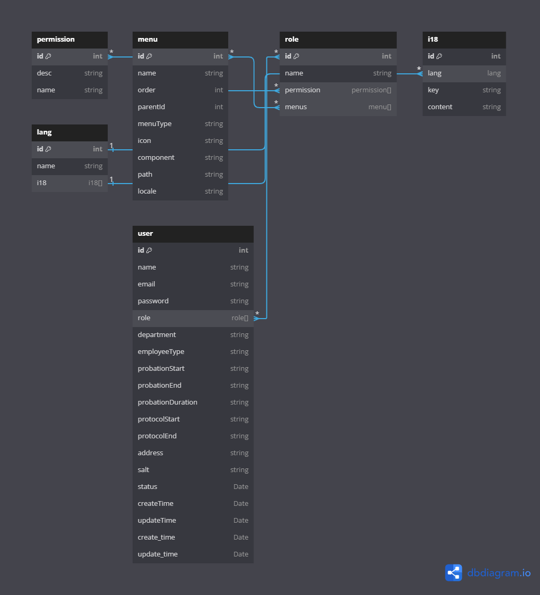

# TinyPro 接口文档

本文档旨在捋清TinyPro后端设计架构。

## 表设计

## 专用术语

- 公开接口: 一个不需要Token的接口, 一般是登录接口.
- 非公开接口: 一个需要Token的接口, 当Token过期时必须返回401响应码. 错误报文格式请参考[异常格式](#异常格式)
- 保护接口: 一个需要相应权限的接口, 会从Token中读取用户Email, 如果Token过期则**必须**返回401响应码，如果用户**没有**相应的权限，**必须**返回一个403响应码，错误报文格式请参考[异常格式](#异常格式)

## 请求示意图

### 公开接口请求示意图

```mermaid
sequenceDiagram
    User->>+Server: 发送请求
    Server->>Server: 是公开接口
    Server->>Server: 处理请求
    Server-->>-User: 返回响应
```

### 非公开接口请求示意图

#### 正常响应

如果用户Token合法且未过期则不会返回异常

```mermaid
sequenceDiagram
    User->>+Server: 发送请求
    Server->>Server: 不是公开接口
    Server->>+AuthGuard: 用户Token
    AuthGuard->>AuthGuard: Token合法
    AuthGuard->>AuthGuard: Token在Redis中未过期
    AuthGuard->>-Server: 放行
    Server->>Server: 处理请求
    Server-->>-User: 返回响应
```

#### 异常响应

如果Token过期或异常则会返回异常响应

```mermaid
sequenceDiagram
    User->>+Server: 发送请求
    Server->>Server: 不是公开接口
    Server->>+AuthGuard: 用户Token
    AuthGuard->>AuthGuard: Token不合法
    AuthGuard-->> -User: 401 Token不合法

    User->>+Server: 发送请求
    Server->>Server: 不是公开接口
    Server->>+AuthGuard: 用户Token
    AuthGuard->>AuthGuard: Token合法
    AuthGuard->>AuthGuard: Token过期
    AuthGuard-->> -User: 401 登陆过期
```

### 保护接口

#### 正常响应

```mermaid
sequenceDiagram
    User->>+Server: 发送请求
    Server->>Server: 不是公开接口
    Server->>AuthGuard: Token
    AuthGuard-->>Server: Token合法且未过期
    Server->>PermissionGuard: 是保护接口
    PermissionGuard->>PermissionGuard: 未设定权限或拥有相应权限
    PermissionGuard -->> Server: 放行
    Server ->> Server: 逻辑处理
    Server ->> -User: 响应
```

#### 异常响应

```mermaid
sequenceDiagram
    User->>+Server: 发送请求
    Server->>Server: 不是公开接口
    Server->>AuthGuard: Token
    AuthGuard-->>Server: Token合法且未过期
    Server->>PermissionGuard: 是保护接口
    PermissionGuard->>PermissionGuard: 未拥有权限
    PermissionGuard-->>User: 权限不足
```
